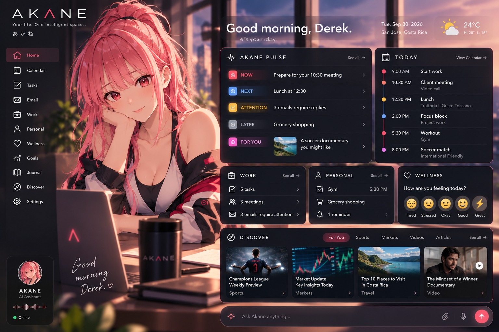

# akane-ai

> **AKANE Dashboard — Concept Prototype**
>
> A personalized AI workspace combining daily planning, work, personal responsibilities, wellness, interests, and connected information into one intelligent view.
# AKANE
### Your life. One intelligent space.

**AKANE** is a personal AI Life & Work Assistant designed to bring your schedule, work responsibilities, personal tasks, reminders, wellness, interests, and daily planning into one intelligent workspace.

> **Status:** Prototype / Active Development  
> **Focus:** AI Assistants · Automation · Productivity · Personalization · Connected Tools · Human-AI Interaction

---

## The Problem

Our lives are spread across different applications.

Calendar events live in one place. Emails in another. Work tasks, personal responsibilities, fitness goals, reminders, notes, interests, and entertainment are often managed separately.

The result is not necessarily a lack of information — it is a lack of **context**.

AKANE explores a different approach: an AI assistant capable of bringing those different parts of life together and helping the user understand what actually requires attention.

---

## The Idea

Instead of opening an AI assistant to an empty chat box every morning, AKANE is designed to already understand the structure of your day.

AKANE can help organize:

- Work
- Calendar events
- Personal responsibilities
- Tasks and reminders
- Emails and follow-ups
- Exercise
- Food and wellness habits
- Goals
- Personal projects
- Journaling
- Sports
- Market information
- Articles and videos
- Personal interests

The objective is not to optimize every minute of someone's life.

The objective is to **organize what matters and make room for life.**

---

## AKANE Pulse

One of the core concepts behind the project is **AKANE Pulse**.

Instead of presenting the user with another overwhelming notification feed, AKANE organizes information into five contextual categories:

### NOW
What requires attention right now.

### NEXT
What is coming up.

### ATTENTION
Something important the user may have overlooked.

### LATER
Tasks or information that do not require immediate attention.

### FOR YOU
Something useful, interesting, relaxing, or enjoyable based on the user's interests.

This creates a continuously updated picture of the user's day.

---

## Morning Briefing

AKANE is designed to begin each day with a personalized overview.

Example:

**Good morning. Here's your day.**

💼 Work: 8:00 AM – 5:00 PM  
📅 Meetings: 3  
✅ Priority Tasks: 2  
📧 Emails requiring attention: 4  
🏋️ Workout: 5:30 PM  
🛒 Personal reminder: Grocery shopping  
⚽ Sports: Match at 8:00 PM

AKANE can then ask:

**How are you feeling today?**

The answer can help AKANE adjust its suggestions while leaving decisions with the user.

---

## Core Features

### Daily Planning
Create a structured overview of work, personal responsibilities, appointments, tasks, and available time.

### Calendar
Understand upcoming commitments, scheduling conflicts, open time, and potential planning opportunities.

### Tasks & Reminders
Capture responsibilities and surface them at the appropriate time.

### Work Assistance
Support emails, meetings, projects, documents, follow-ups, and professional workflows.

### Personal Life
Keep errands, appointments, family responsibilities, personal projects, and other commitments visible alongside work.

### Wellness
Support general organization around exercise, food, sleep, breaks, hydration, and personal downtime.

### Journal
Provide an optional conversational space for reflection and end-of-day journaling.

### Discover
Surface optional content related to interests such as sports, markets, articles, videos, entertainment, and social content.

---

## Connected AI

AKANE is being designed around the idea that AI becomes more useful when it can securely work with the tools people already use.

Potential integrations include:

- Email
- Calendar
- Task management
- Documents
- Health and fitness platforms
- Market information
- Sports information
- News
- Video platforms
- Social platforms

Each integration should use clear permissions and remain under user control.

---

## Personalized AI Avatar

AKANE is represented by a customizable anime-inspired AI avatar.

The avatar is intended to create a consistent identity across:

- Mobile
- Desktop
- Widgets
- Notifications
- Voice interactions

AKANE may visually adapt to different contexts such as:

☀️ Morning  
💼 Work  
🎯 Focus  
🏋️ Fitness  
✈️ Travel  
🌙 Evening

The visual identity supports the experience, while the assistant's intelligence and usefulness remain the core of the product.

---

## Human Control

A central design principle of AKANE is:

> **AI proposes. The user decides.**

AKANE can organize information, identify conflicts, surface forgotten responsibilities, suggest scheduling changes, and prepare actions.

Important decisions remain with the user.

---

## Privacy by Design

A personal AI assistant may interact with highly personal information.

AKANE is therefore designed around transparent, granular permissions.

Example:

| Connection | Read | Modify |
|---|---|---|
| Calendar | ✓ | User controlled |
| Email | ✓ | User controlled |
| Tasks | ✓ | User controlled |
| Health | Optional | Limited |
| Financial Information | Optional | Restricted |
| Social | Optional | User controlled |

AKANE should also be able to explain where information came from when requested.

---

## Product Roadmap

### Phase 1 — Core Assistant

- Daily dashboard
- AKANE Pulse
- Calendar
- Tasks
- Reminders
- Email assistance
- Morning briefing
- Personal check-ins

### Phase 2 — Personal Intelligence

- Journal
- Goals
- Wellness
- Exercise
- Food planning
- Weekly review
- Deeper contextual memory

### Phase 3 — Connected Life

- Sports
- Markets
- News
- Video
- Social content
- Finance
- Travel

### Phase 4 — AKANE Everywhere

- Smartphone widget
- Desktop widget
- Voice interaction
- Personalized avatar
- Cross-device continuity
- Advanced automation

---

## What I'm Learning

AKANE is an ongoing learning project exploring:

- AI assistants and agents
- Prompt and instruction design
- AI workflow architecture
- Automation
- APIs and connectors
- Context and memory
- Human-AI interaction
- Product design
- User experience
- Privacy and permissions
- Responsible AI design
- AI prototyping

The project is intentionally iterative.

Rather than attempting to build every capability simultaneously, individual workflows are being designed, prototyped, tested, and improved over time.

---

## Current Development Focus

The current prototype focuses on the core daily loop:

**Morning Briefing → AKANE Pulse → Daily Tasks → Work & Personal Assistance → Check-In → Evening Review**

---

## Vision

Traditional digital assistants primarily wait for instructions.

AKANE explores a more contextual model:

> **An AI that understands the structure of your day, brings relevant information together, helps you organize it, and adapts as your plans change.**

### AKANE
**Your life. One intelligent space.**

---

*AKANE is an independent experimental AI project currently in prototype development.*
